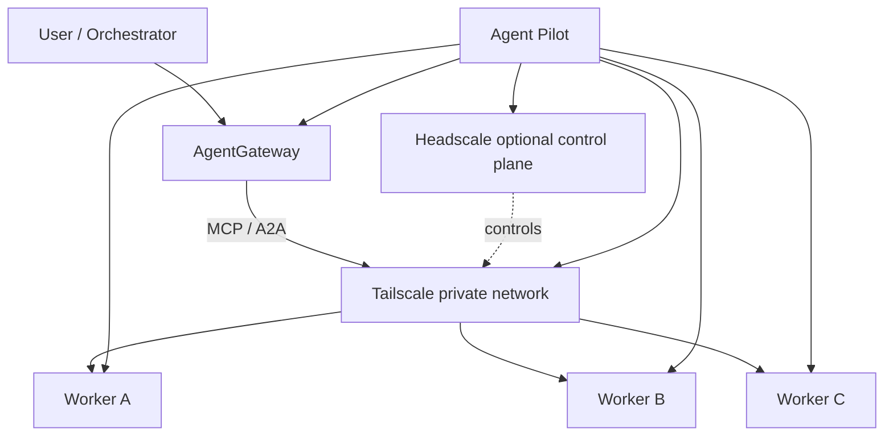

# ✈️ Agent Pilot

<p align="center"><strong>One terminal. One installer. Your own private AI agent network.</strong></p>
<p align="center">Vendor-neutral · Open-source first · MCP/A2A-ready · Private networking by default</p>
<p align="center"></p>

Agent Pilot is a terminal-first installer and integration layer for building private networks of AI agents, gateways, and tools.

Instead of repackaging third-party projects into one monolith, Agent Pilot acts as the **pilot**: choose a role, tick the components you want, review the plan, and let the installer fetch each component from its official upstream source, configure it, connect it, and verify the node.

> **Status:** early MVP. The architecture is modular so new agents, gateways, runtimes, and transports can be added without redesigning the project.

## Why Agent Pilot?

A real multi-agent setup means juggling agent runtimes, gateway configuration, private networking, credentials, MCP endpoints, A2A routing, containers, services, environment variables, updates and health checks.

Agent Pilot reduces that to:

```text
Select role → Select components → Review plan → Install → Configure → Verify
```

No vendor lock-in. No bundled forks. No ritual sacrifice to YAML.

## Architecture



| Layer | Purpose |
|---|---|
| **Agent Pilot** | Installation, configuration, upgrades, validation |
| **AgentGateway** | Routing, MCP/A2A connectivity, policy boundary |
| **Tailscale** | Private encrypted network between nodes |
| **Headscale** | Optional self-hosted Tailscale-compatible control plane |
| **Worker agents** | Coding, research, automation, tools |
| **MCP / A2A** | Interfaces between agents, tools, and gateways |

Agent Pilot is **not** the agent and **not** the gateway. It is the deployment and integration layer that makes the stack repeatable.

## Terminal experience

```text
╭──────────────────────────────────────────────╮
│               AGENT PILOT                    │
│         Private Agent Node Installer         │
├──────────────────────────────────────────────┤
│ Role                                         │
│   ◉ Gateway node                             │
│   ○ Worker / agent node                      │
│   ○ Headscale control-plane                  │
│                                              │
│ Components                                   │
│   ☑ AgentGateway                             │
│   ☑ Tailscale                                │
│   ☐ Headscale                                │
│   ☐ Hermes Agent                             │
│   ☑ OpenCode                                 │
│   ☐ Codex CLI                                │
│                                              │
│ ↑/↓ move   Space toggle   Enter continue     │
╰──────────────────────────────────────────────╯
```

Controls: `↑ / ↓` move, `Space` toggle, `Enter` confirm, `Ctrl+C` cancel.

## Roles

- **Gateway node**: AgentGateway + private networking + optional local agent apps.
- **Worker node**: one or more agent apps + private networking.
- **Headscale control-plane**: optional self-hosted Tailscale-compatible control server.

## Open-source agent registry

Agent Pilot uses a registry instead of hardcoding one agent. The initial catalog includes:

- Hermes Agent
- OpenCode
- Codex CLI
- Aider
- Cline
- goose
- OpenHands Agent Canvas
- Gemini CLI
- Qwen Code

Archived entries can remain discoverable without being selectable.

Each registry entry can define official source/docs URL, license, supported interfaces, MCP/A2A capabilities, project status and installer adapter.

### Model policy

Agent Pilot **does not configure, bundle, select, or provision AI models**. It installs agent applications only. The user connects their preferred model/provider inside that agent afterwards.

## Installation

```bash
git clone https://github.com/Krutas/Agent-Pilot.git
cd Agent-Pilot
./install.sh
```

Dry-run first:

```bash
./install.sh --dry-run
```

Non-interactive example:

```bash
./install.sh --dry-run --role gateway --components agentgateway,tailscale,opencode
```

## Connections and credentials

```bash
cp .env.example .env
chmod 600 .env
```

`.env.example` is a live instruction sheet. Optional endpoints and credentials are commented out. Uncomment only the settings you use and replace the example value.

Examples include Tailscale, Headscale, AgentGateway, MCP, A2A, generic remote agents, callback/webhook, optional PostgreSQL state store and application path overrides.

Real credentials stay in `.env` or a dedicated secret store and must never be committed.

## Component model

Agent Pilot does **not** vendor third-party source code. The repository stores only registry metadata, upstream links, installer adapters, configuration templates, integration logic and tests.

Adding another agent should require one registry entry plus one installer adapter.

## Safety philosophy

- no secrets in Git
- dry-run before installation
- explicit confirmation before host changes
- install from official upstream sources
- download upstream scripts locally before execution instead of blindly piping them to a shell
- prefer pinned versions and checksums/signatures when upstream publishes them
- fail loudly on broken dependencies

## Repository structure

```text
Agent-Pilot/
├── install.sh
├── pyproject.toml
├── .env.example
├── manifests/components.yaml
├── agent_pilot/
│   ├── cli.py
│   ├── catalog.py
│   ├── models.py
│   ├── runner.py
│   └── tui.py
├── scripts/
│   ├── lib/common.sh
│   └── components/
├── docs/agent-pilot-tui.jpg
└── tests/test_catalog.py
```

## Roadmap

- [x] Role-based installer architecture
- [x] Terminal multi-select UX
- [x] Registry-based component catalog
- [x] Tailscale / Headscale / AgentGateway adapters
- [x] Multiple OSS agent adapters
- [x] `.env.example` connection template
- [x] Dry-run mode
- [ ] Full end-to-end install test on a clean Ubuntu VM
- [ ] Automated post-install health checks
- [ ] MCP endpoint registration wizard
- [ ] A2A agent registration
- [ ] Tailscale/Headscale policy generation
- [ ] Update and rollback support
- [ ] Signed/pinned component releases
- [ ] Plugin-style community registry

## License

MIT
